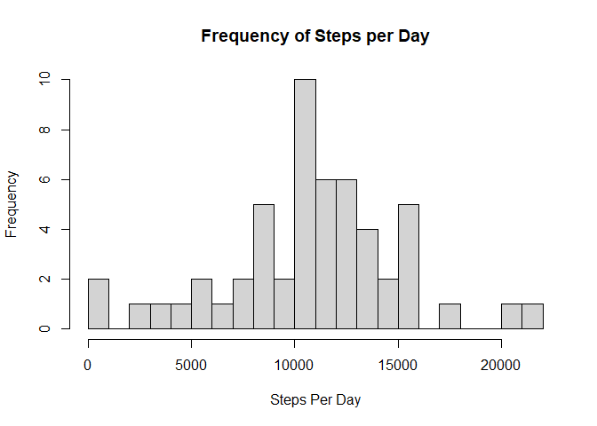
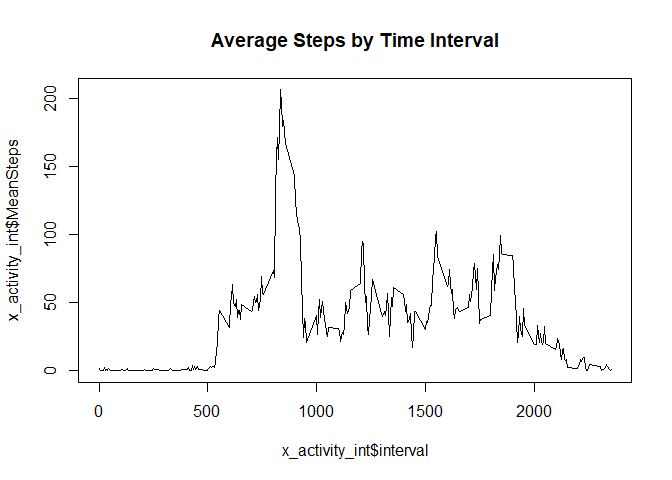
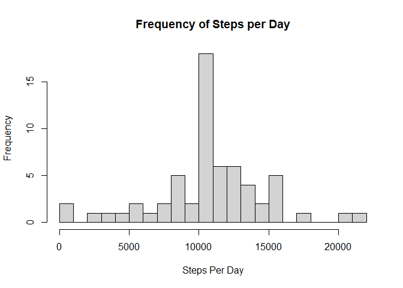
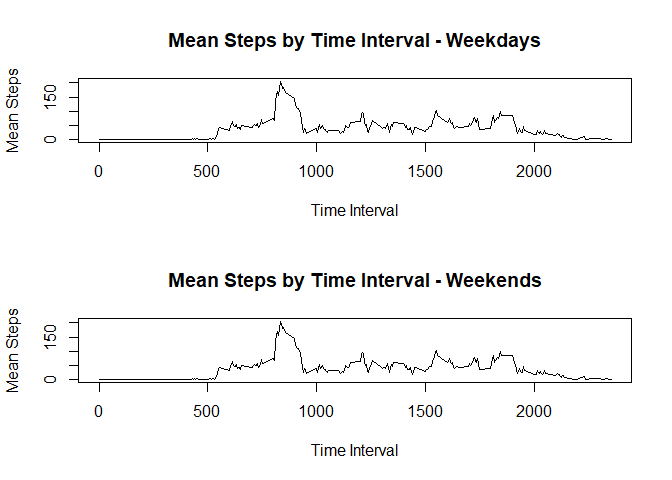

## Loading and preprocessing the data

First we initialize the workspace 


```r
# Code for reading in the dataset and/or processing the data
# load libraries
rm(list=ls())
library(dplyr)
```

```
## 
## Attaching package: 'dplyr'
```

```
## The following objects are masked from 'package:stats':
## 
##     filter, lag
```

```
## The following objects are masked from 'package:base':
## 
##     intersect, setdiff, setequal, union
```

```r
library(tidyr)
```

```
## Warning: package 'tidyr' was built under R version 4.0.4
```
Next, load the csv source file into a dataframe

```r
x_activity <- read.csv("Activity/Activity.csv", header = TRUE, col.names = c("steps", "date", "interval"))
x_activity_daily <- x_activity %>%
    group_by(date)  %>%
    summarise(dailySteps = sum(steps))
```

## What is mean total number of steps taken per day?
Histogram of daily steps

```r
hist(x_activity_daily$dailySteps, breaks = 25, 
     main = "Frequency of Steps per Day",      xlab = "Steps Per Day")
```

<!-- -->

#  Mean and median number of steps taken each day

```r
x_activity_mean <- mean(x_activity_daily$dailySteps, na.rm = TRUE)
x_activity_median <- median(x_activity_daily$dailySteps, na.rm = TRUE)
```
The mean number of daily steps is 1.0766189\times 10^{4}.  The median number of daily steps is `x_activity_median`.

## What is the average daily activity pattern?

#Time series plot of the average number of steps taken


```r
x_activity_int <- x_activity %>%
  group_by(interval)  %>%
  summarise(IntSteps = sum(steps, na.rm = TRUE), MeanSteps = mean(steps, na.rm = TRUE))

plot(x_activity_int$interval, x_activity_int$MeanSteps, type="l", main = "Average Steps by Time Interval")
```

<!-- -->

#The 5-minute interval that, on average, contains the maximum number of steps


```r
max_int <- x_activity_int[which.max(x_activity_int$MeanSteps), 1]
```
Interval  835 contains the maximum number of steps.


## Imputing missing values
The strategy for imputing missing values is to fill missing values with the mean for that particular time interval.  In the same loop observations are also coded as "weekend" or "weekday"


```r
#
x_activity_filled <- left_join(x_activity, x_activity_int, by= "interval")

z <- 0
i = 1
while (i <= length(x_activity_filled$steps)) {
    if (is.na(x_activity_filled[i,1])) {
     #    z <- z + 1
        x_activity_filled[i,1] <- x_activity_filled[i,5]
    }
  i <- i + 1
}
x_activity_filled <- mutate(x_activity_filled, dtype = ifelse(weekdays(as.Date(date)) == "Saturday" | weekdays(as.Date(date)) == "Sunday", "weekend", "weekday"))
```
 
#Histogram of the total number of steps taken each day after missing values are imputed

```r
x_activity_daily_filled <- x_activity_filled %>%
  group_by(date)  %>%
  summarise(dailySteps = sum(steps))

hist(x_activity_daily_filled$dailySteps, breaks = 25, 
     main = "Frequency of Steps per Day",      xlab = "Steps Per Day")
```

<!-- -->
#  Mean and median number of steps taken each day

```r
x_activity_mean_filled <- mean(x_activity_daily_filled$dailySteps, na.rm = TRUE)
x_activity_median_filled <- median(x_activity_daily_filled$dailySteps, na.rm = TRUE)
```


## Are there differences in activity patterns between weekdays and weekends?

  
#Panel plot comparing the average number of steps taken per 5-minute interval across weekdays
# and weekends

```r
x_activity_int_filled_weekday <- x_activity_filled %>%
  filter(dtype == 'weekday')  %>%
  group_by(interval)  %>%
  summarise(IntSteps = sum(steps, na.rm = TRUE), MeanSteps = mean(steps, na.rm = TRUE))

x_activity_int_filled_weekend <- x_activity_filled %>%
    filter(dtype == 'weekend') %>%
  group_by(interval)  %>%
    summarise(IntSteps = sum(steps, na.rm = TRUE), MeanSteps = mean(steps, na.rm = TRUE))

  par(mfrow=c(2,1))

  plot(x_activity_int_filled_weekday$interval, x_activity_int$MeanSteps, type="l", main = "Mean Steps by Time Interval - Weekdays",      xlab = "Time Interval", ylab = "Mean Steps")

  plot(x_activity_int_filled_weekend$interval, x_activity_int$MeanSteps, type="l", main = "Mean Steps by Time Interval - Weekends",      xlab = "Time Interval", ylab = "Mean Steps")
```

<!-- -->


